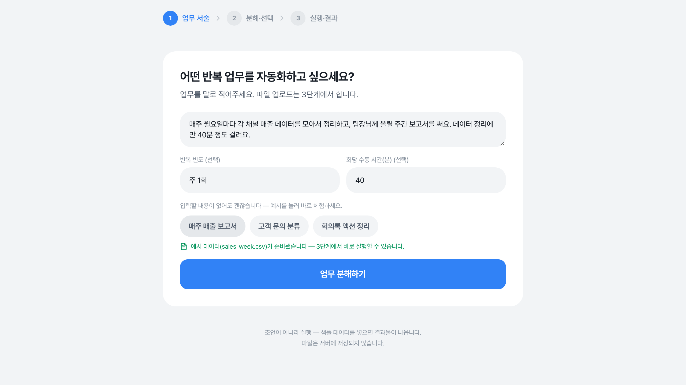
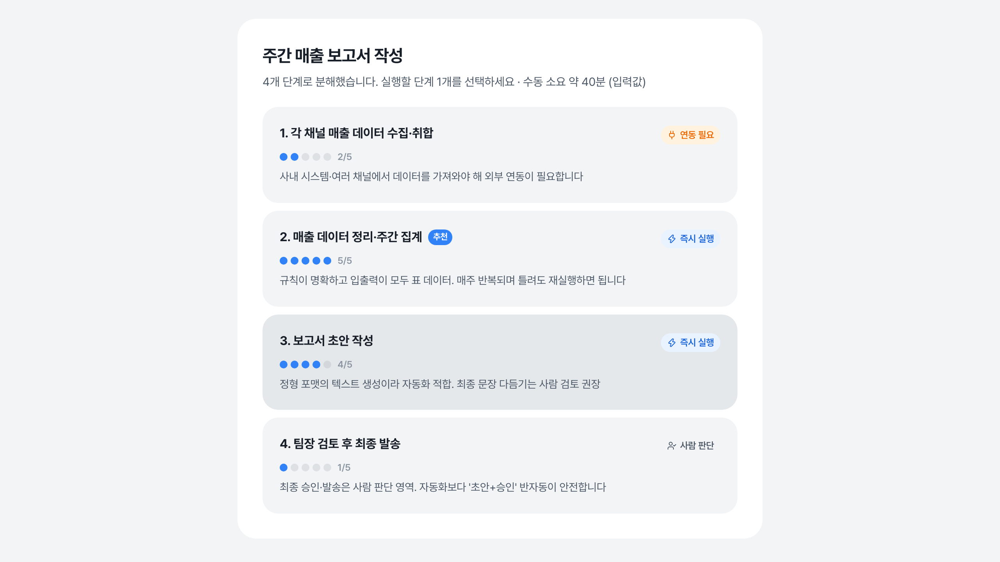
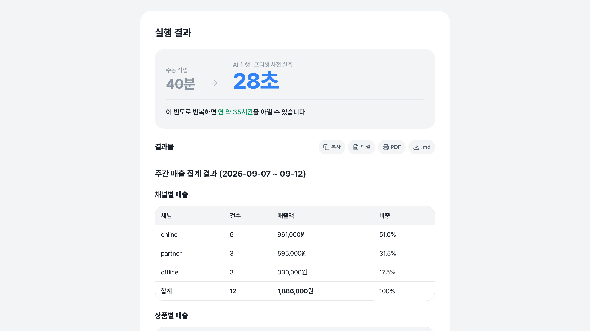
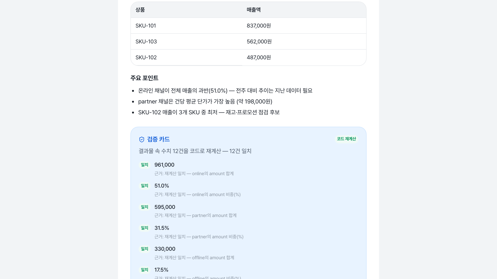
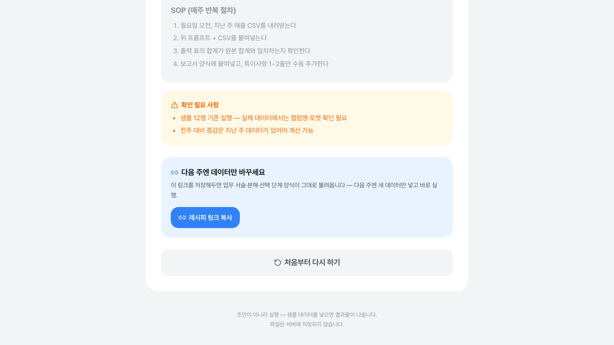

# 업무→실행 자동화기

> **조언이 아니라, 실행.** 반복 업무를 말로 적으면 AI가 단계로 분해하고, 가장 자동화하기 좋은 단계를 골라 **샘플 데이터로 그 자리에서 실제로 한 번 실행**해 결과물까지 보여주는 서비스.

**라이브 서비스**: https://wanted-hackathon.vercel.app
원티드 AI Championship 2026 출전작 · 대회: https://event.wanted.co.kr/ai-championship/2026


---

## 1. 어떤 문제를 푸는가

한국 근로자의 **51.8%가 생성형 AI를 업무에 쓰지만, 업무 시간은 평균 3.8%만 줄었습니다.** 가장 많이 쓰는 기능은 자료 검색(25%)·정보 요약(15.4%) — AI는 도입됐지만 업무 방식은 바뀌지 않았습니다.

원인은 도구가 아니라 구조입니다:

- **"내 업무 중 뭘 자동화할 수 있는지"를 분해·판단할 방법이 개인에게 없다** — 자동화 도구(Zapier·Make)는 사용자가 이미 답을 안다고 가정하고, 자동화 진단은 기업 단위 컨설팅으로만 팔립니다.
- **실행해도 재작업이 남는다** — AI 결과물을 실무에 쓰려면 회사 양식에 다시 맞추고, 숫자를 사람이 재검증해야 합니다. AI 사용자의 31%가 이 재작업에 주 1~2시간을 씁니다.
- **매주 같은 셋업을 반복한다** — 다음 주에도 데이터만 바뀐 같은 작업인데, 프롬프트·양식·확인 절차를 처음부터 다시 합니다.

(수치 출처: `docs/discovery/problems.md` P1 — 아시아경제 2025.8 / 노션×대학내일20대연구소 2026.2)

## 2. 이 서비스는 무엇인가

직장인이 자기 업무를 **말로 적으면**, 그 자리에서:

```
[1] 업무 서술     "매주 월요일 매출 CSV 정리해서 팀장님께 보고서로 올려요"
                    (+ 선택: 반복 빈도, 회당 수동 시간)

[2] 분해·판정     업무를 3~6개 단계로 분해 + 단계별 자동화 적합도 점수(1~5)
                    + 실행 가능성을 3종으로 정직하게 분류:
                    ⚡ 즉시 실행 / 🔌 연동 필요 / 👤 사람 판단

[3] 실행          선택한 단계를 샘플 데이터로 AI가 실제 1회 수행
                    → 결과물 (정제 표·보고서 초안)
                    → 수동 40분 → 28초 before/after + 연간 절감 환산
                    → 코드 재계산 검증 카드
                    → 자연어 수정 → 재검증 "일치"
                    → 복사·.md·엑셀 CSV·PDF 내보내기
                    → 레시피 링크 저장 (다음 주엔 데이터만 교체)
```

대상 사용자는 **개발자가 아닌 사무직 직장인**입니다. 그래서:

- 입력은 파일 업로드뿐 아니라 **엑셀 복사·붙여넣기(TSV)**를 직접 인식합니다 — 사무직의 실제 데이터 이동 경로가 "파일 저장"이 아니라 "복붙"이기 때문입니다.
- 첫 방문에는 **인터랙티브 가이드 투어**(react-joyride)가 뜨고, 보여주기가 아니라 **예시 데이터로 앱을 실제 구동**합니다 — 프리셋 채우기 → 분해 → 추천 선택 → 실행까지 화면이 진짜로 움직입니다.
- "안 되는 업무"를 넣어도 정상 동작합니다 — 억지로 자동화하지 않고 「연동 필요」「사람 판단」 배지와 사유·대안을 보여줍니다.

## 3. 화면 — 실제 플로우 (프로덕션 캡처)

**① 입력** — 반복 업무를 말로 적습니다. 프리셋 3종(매출 보고서·문의 분류·회의록)은 1클릭으로 서술+샘플 데이터가 채워집니다. 상단에 3단계 진행 표시, 우상단「사용법」버튼으로 투어 재시작.



**② 분해·판정** — 업무가 4개 단계로 분해되고, 단계마다 자동화 적합도 점수(1~5)·분류 배지(즉시 실행/연동 필요/사람 판단)·근거가 붙습니다. 추천 단계를 선택하면 실행 패널이 열립니다 — 파일 업로드 또는 **엑셀 복사·붙여넣기**로 데이터를 넣고, 우리 팀 양식을 붙여넣어 그 구조로 채우게 할 수도 있습니다.



**③ 실행 결과** — 선택 단계가 실제로 실행돼 결과물(정제 표·보고서 초안)이 만들어집니다. "수동 40분 → **AI 28초**" before/after + 연간 절감 환산이 함께 표시되고, 결과물은 **복사·엑셀 CSV·PDF·.md** 4종으로 바로 내보낼 수 있습니다.



**④ 검증 카드** — 결과물 속 수치를 **코드가 샘플 데이터로 재계산**해 항목별 "일치/확인 필요"와 근거를 보여줍니다. `코드 재계산` 배지 = 결정적 계산 결과, `AI 검토` 배지 = 자유 텍스트라 코드 검증이 제한된 경우로 정직하게 구분됩니다.



**⑤ 수정·재사용** — 자연어로 결과물을 수정 요청하면(수정 후 코드가 재검증), 워크플로는 **레시피 링크**로 저장됩니다 — 다음 주엔 링크를 열어 새 데이터만 넣고 바로 실행.



## 4. 핵심 차별점

### ① 조언이 아니라 실행
추천·분석·컨설팅 도구는 많지만, **자연어 서술 → 분해 → 샘플 데이터 실제 실행**까지 가는 개인용 서비스는 없었습니다(대체재 분석: `docs/discovery/problems.md` P1). LLM 호출 자체가 실행 엔진입니다(LLM-as-executor, `service_design.md` §5).

### ② 결과물을 코드가 검증한다 (LLM 자기 검증 폐기)
AI가 만든 결과물의 숫자를 **코드가 샘플 데이터로 재계산해 대조**합니다(`lib/verify.ts`). LLM이 자기 출력을 스스로 "검증"하는 건 순환 논리라 폐기했습니다. 실제로 프로덕션에서 gpt-4o-mini가 합계를 1,686,000(정답 1,886,000)으로 틀리고 자기 LLM 검증은 "일치"로 거짓 승인한 걸, 코드 재계산이 "재계산하면 1,886,000 — 확인 필요"로 적발했습니다. 검증 카드엔 출처 배지(코드 재계산/AI 검토)가 붙어 정직하게 구분됩니다.

### ③ 재작업 제거
회사 양식을 붙여넣으면 **그 양식 구조 그대로 채운 결과물**을 출력하고(`output_format`), 자연어 수정 → 코드 재검증 "일치" 루프로 다듬습니다.

### ④ 레시피 링크 — 로그인 없이 재사용
워크플로(서술·분해·선택 단계·양식)를 URL `#r=` fragment에 base64 인코딩해 링크로 저장. **DB도 로그인도 없이** "다음 주엔 데이터만 바꿔 재실행"이 성립합니다.

## 5. 아키텍처

```
┌────────────────────────────────────────────────────────────┐
│  브라우저 (React 19 · 단일 페이지 3단계 UI)                    │
│  components/automation-app.tsx                              │
│   · 파일→텍스트 변환·붙여넣기·내보내기·레시피 인코딩은 전부      │
│     클라이언트 — 서버 저장 없음 (stateless)                    │
└──────────────┬─────────────────────────────────────────────┘
               │ JSON POST
┌──────────────▼─────────────────────────────────────────────┐
│  Next.js API Routes (Vercel serverless, maxDuration 60s)   │
│                                                            │
│  POST /api/decompose ─┐                                    │
│  POST /api/execute    ├─ 입력 검증(크기·스키마·타입)           │
│  POST /api/revise    ─┤   → 프리셋 캐시 매칭(서술+단계+데이터  │
│                        │     3개 일치 시만 즉시 반환)          │
│  GET  /api/presets   ─┘   → withRetry (429 retryDelay 적응   │
│                             대기, ≤50s, 3회)                │
│                           → lib/engine.ts                   │
└──────────────┬─────────────────────────────────────────────┘
               │
┌──────────────▼─────────────────────────────────────────────┐
│  lib/engine.ts — LLM 호출 (OpenAI 호환 /chat/completions)   │
│   · DECOMPOSE: 업무→단계 분해+5축 점수+3종 분류 (JSON 강제)    │
│   · EXECUTE: 단계+샘플 데이터→결과물 마크다운+프롬프트팩+SOP    │
│   · REVISE: 결과물+자연어 지시→수정본 재출력                   │
│   · env 없으면 mock — LLM_API_KEY 미설정도 플로우 확인 가능     │
└──────────────┬─────────────────────────────────────────────┘
               │
┌──────────────▼─────────────────────────────────────────────┐
│  lib/verify.ts — 코드 재계산 검증 (LLM 독립, 결정적)           │
│   · 구분자 감지: 탭(엑셀 복붙)→세미콜론→콤마, 전 행 일치 시만   │
│   · 유도값: 전체/그룹 합계·평균·최대·최소·건수·비중·유니크 수·  │
│     원문 셀                                                  │
│   · 결과물 수치 추출(콤마·쌩숫자·%·단위) → 맥락 토큰 매칭으로   │
│     근거 귀속 → 정수는 정확 일치, 비정수는 0.5% 허용          │
│   · 가능하면 LLM 카드 대신 코드 카드로 교체 (source: code)    │
└────────────────────────────────────────────────────────────┘
```

**설계 원칙**: DB·로그인·서버 저장이 전혀 없습니다. 샘플 데이터는 클라이언트 메모리에서 API로 텍스트 전송되고 응답만 받습니다(유일한 예외: `sessionStorage`의 "사용법 봤음" UI 플래그 — 사용자 데이터 아님). 레시피 링크도 서버 저장이 아니라 URL 인코딩입니다.

### 정직한 실행 분류 — 핵심 설계

모든 단계를 자동화한다고 말하지 않습니다:

| 분류 | 의미 | 서비스 동작 |
|---|---|---|
| `executable` | 텍스트/표 변환 — 지금 실행 가능 | 샘플 업로드 → 실제 실행 |
| `integration_needed` | 외부 시스템 연동 필요 (메일·사내DB) | 실행 대신 아티팩트(연동 안내+프롬프트팩/SOP) |
| `human_judgment` | 사람 판단이 핵심 (승인·협상) | "반자동(초안+사람 승인) 권장" 안내 |

실행 불가 업무도 정상 결과가 되게 설계 — "모든 걸 자동화"가 아니라 **정직한 분해**가 신뢰성입니다.

## 6. 기술 스택

| 영역 | 선택 | 이유 |
|---|---|---|
| 프레임워크 | **Next.js 15 (App Router) + React 19 + TypeScript** | 단일 페이지 + 서버리스 API 4개, Vercel 무료 배포로 심사 기간(2주) 생존 |
| LLM | **OpenAI `gpt-4o-mini`** (OpenAI 호환 API) | `LLM_BASE_URL`·`LLM_MODEL` env로 Upstage Solar 등 호환 모델 교체 가능 |
| 검증 | **자체 코드 재계산** (`lib/verify.ts`, 의존성 0) | LLM 자기 검증의 순환 논리 제거 |
| UI | Tailwind CSS v4 + shadcn/ui(4개 프리미티브만) + Pretendard Variable | 토스 디자인 시스템 토큰(#3182f6 blue500·#f2f4f6 grey100·플랫 카드 24px) |
| 온보딩 | react-joyride v3 | `before` 훅으로 실제 앱을 구동하는 인터랙티브 투어 |
| 렌더링 | react-markdown + remark-gfm | 결과물 마크다운 = 미리보기 |

## 7. 어떻게 개발했는가 — 루프 엔지니어링

"AI로 코드를 생성"한 게 아니라, **개발 과정 자체를 에이전트 파이프라인으로 설계**했습니다:

```
해커톤 룰 파악 → 시장 리서치(출제자·경쟁사·유저 피드백 컨텍스트 빌딩)
→ 문제 후보 5개 도출+사이징 → 솔루션 후보 8개 → ICE 우선순위
→ 서비스 스펙(AGENTS.md·service_design.md·API 계약) 먼저 확정
→ 구현 → 평가 하네스로 측정 → 프롬프트 1변수씩 반복 → 동결
```

- **계약 우선**: `lib/types.ts`를 API SoT로 먼저 고정하고, 계약 변경 시 eval 스크립트·문서를 같은 커밋에서 동기화하는 규칙을 세웠습니다.
- **측정 기반 프롬프트 튜닝**: "감으로 튜닝" 방지를 위해 평가셋 13케이스 + `scripts/eval_run.py`로 매 변경을 재측정. 1반복=1변수, cap 10회.
  - iter0 mock 스모크 → iter1 (gemini-3.5-flash, 429 포화 발견) → iter2 (flash-lite, exec 100%) → iter3~4 (분해 프롬프트 정직화, 분류일치 10/13 수렴) → **동결** → gpt-4o-mini로 재측정해 동일 수치 확인.
  - 잔여 3건은 metric 한계(추천이 이미 정직한데 이진 채점이 못 잡는 논쟁 케이스)로 판명 — metric을 위해 제품을 왜곡하지 않기로 결정(`DECISIONS.md`).
- **프로덕션 실측으로 버그 2건 적발·수정**: ①LLM이 `152,000` 대신 `152000`(쌩숫자)로 출력하면 검증이 조용히 우회되던 버그 ②`offline의`처럼 라틴/한글 경계 토큰화로 근거가 오매칭되던 버그 — 둘 다 실제 배포 후 실측에서 잡아 수정했습니다.

전체 이력: `docs/process_log.md` · 결정 근거: `DECISIONS.md`

## 8. 평가 결과 (실측)

| 지표 | 결과 | 출처 |
|---|---|---|
| 평가셋 13케이스 실행 성공률 | **100%** | `eval_runs/` iter2~4, gpt-4o-mini 재측정 동일 |
| 치명적 실패 (P0: 실행 실패·빈 결과) | **0건** | 동 상 |
| 분해 응답 유효율 | 13/13 | 동 상 |
| 자동 분류일치 | 10/13 (잔여 3건 = metric 한계·논쟁 케이스) | `docs/process_log.md` |
| 검증 카드 실효성 | gpt-4o-mini 오계산 2건 실제 적발 (1,686,000→1,886,000 / 480,000→482,000) | 프로덕션 실측 |
| before/after | 수동 40분 → 실행 28초 (프리셋 사전 실측) | `lib/presets.ts` |

## 9. 레포 구조

```
app/
  page.tsx, layout.tsx, globals.css     # 단일 페이지 + 토스 토큰 + 인쇄 CSS
  api/decompose|execute|presets|revise/ # 서버리스 API 4개
components/
  automation-app.tsx                    # 3단계 UI + 인터랙티브 투어 + 내보내기 + 레시피
  ui/ (button·input·label·textarea)     # shadcn 프리미티브 4개만
lib/
  types.ts      # API 계약 — source of truth
  engine.ts     # LLM 호출 (분해·실행·수정 프롬프트 + mock)
  verify.ts     # 코드 재계산 검증 (구분자 감지·유도값·맥락 매칭)
  presets.ts    # 데모 프리셋 3종 (캐시된 실측 결과 포함)
eval_set/       # 평가 케이스 13개 (description+sample+expected.json)
scripts/
  eval_run.py   # 평가셋 실행·채점 → eval_runs/<ts>/ (gitignored, 재생성)
  ops_check.sh  # 배포 생존 확인 → ops_log.md append
docs/           # 설계·측정·과정·제출 문서 (아래 문서 맵)
AGENTS.md       # 작업 규칙 — SoT 표·컨벤션·검증 절차
NEXT.md         # 현재 상태·다음 행동 — 세션 시작 시 먼저 읽기
DECISIONS.md    # 결정 로그 (날짜—결정—이유)
```

## 10. 실행

```bash
cp .env.example .env   # LLM_API_KEY / LLM_BASE_URL / LLM_MODEL
npm install
npm run dev            # http://localhost:3000
```

- 키가 없으면 **mock 모드**로 전체 플로우 확인 가능. 프리셋 3개는 API 키 없이도 캐시된 실측 결과를 반환합니다(LLM 장애에도 데모 가능한 설계).
- 배포는 `npx vercel deploy --prod` (Vercel, env 3개 등록 필요).

## 11. 검증

```bash
npm run build                                   # 타입·빌드
python3 scripts/eval_run.py --base-url <url>    # 평가셋 13케이스 → eval_runs/<ts>/
./scripts/ops_check.sh https://wanted-hackathon.vercel.app   # 생존 확인
```

## 12. 한계 · Non-goals (정직하게)

- **자유 텍스트 검증은 약함** — 회의록·문의(프리셋 3종 중 2종)는 코드 재계산이 불가해 "AI 검토" 카드로 표기됩니다. 킬러 경로는 표 데이터입니다.
- **"자동화"는 1회 실행 가속** — 매주 사용자가 데이터를 넣고 버튼을 누르는 구조입니다. 지속 자동화는 생성되는 프롬프트팩·SOP를 사용자 환경에 이식하는 방식(post-launch).
- **네이티브 .xlsx/.pptx 미생성** — SheetJS npm의 공개 CVE·수작업 검증 리스크 대비, 실제로 열리는 CSV(BOM)·인쇄 PDF로 대체(`service_design.md` §9 사유).
- **레시피 링크에 업무 서술이 포함** — 링크를 받은 사람은 서술 내용을 볼 수 있습니다(기밀 서술 주의).
- 멀티 단계 전체 실행·외부 연동·스케줄링·로그인은 의도적 제외 — "1개 차별점의 깊이" 전략.

## 문서 맵

| 문서 | 내용 |
|---|---|
| `docs/service_design.md` | 서비스 기획서 — 입출력 계약·스코어링·분류·non-goals·실패 모드 |
| `docs/measurement.md` | North Star(1회 실행 절감 시간)·보조 지표 |
| `docs/discovery/problems.md` | 문제 정의·근거 수치·대체재 분석 |
| `docs/discovery/decision.md` | 솔루션 8개 평가 → 선정 근거 |
| `docs/process_log.md` | 작업 이력 — 모든 실측 수치의 출처 |
| `docs/submission/` | 제출 체크리스트·제출 폼 최종 문구 |
| `eval_set/README.md` | 평가셋 규격·케이스 작성법 |
